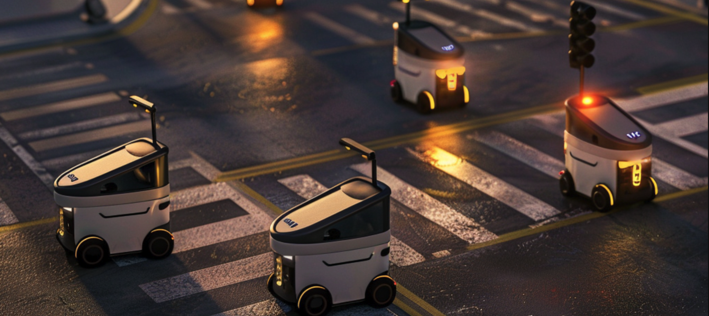

# Welcome to UrbanAI 👋👮‍♂️🚦 

Smart City Traffic Management System - Powered by [OpenAI Swarm](https://github.com/openai/swarm) 


## Overview

This project demonstrates the power of **multi-agent systems** to manage and optimize a city's traffic flow, public transportation, emergency response, and pedestrian movement. Built using **AI-driven agents** within a **Swarm framework**, the system showcases the collaborative, real-time decision-making capabilities of autonomous agents to tackle urban challenges.

The system includes specialized agents—each responsible for distinct city operations—working together to ensure efficient traffic management. This project highlights the potential for smart city infrastructure, using AI to reduce congestion, streamline public transportation, prioritize emergency services, and manage pedestrian crossings.

The **goal** of this project is to demonstrate how advanced AI techniques can be applied in a practical, real-world setting to improve urban environments, while showcasing my technical proficiency in building intelligent, scalable solutions using Python, multi-agent frameworks, and API-driven architectures.

---

## Use Cases

### 1. **Real-Time Traffic Management**
   - **Scenario**: The Traffic Light Control Agent monitors vehicle density at intersections and adjusts signal timings dynamically to ensure optimal flow. This reduces congestion during peak hours and prevents bottlenecks.
   - **Benefit**: Enhances traffic flow, reduces wait times, and minimizes vehicle emissions through efficient traffic control.

### 2. **Public Transportation Optimization**
   - **Scenario**: The Public Transport Agent dynamically reroutes buses based on real-time traffic conditions and adjusts schedules to prevent delays, ensuring commuters reach their destinations efficiently.
   - **Benefit**: Improves public transportation reliability and minimizes disruptions for passengers.

### 3. **Emergency Vehicle Prioritization**
   - **Scenario**: The Emergency Response Agent monitors emergency incidents and clears routes by rerouting vehicles and adjusting traffic signals, allowing emergency services to reach their destinations quickly.
   - **Benefit**: Reduces response time for emergency services, potentially saving lives and minimizing damage.

### 4. **Pedestrian Flow Management**
   - **Scenario**: The Pedestrian Flow Agent adjusts pedestrian crossing times based on foot traffic data, balancing the flow between pedestrians and vehicles.
   - **Benefit**: Improves pedestrian safety while ensuring minimal disruption to vehicle traffic, creating a seamless interaction between different road users.

### 5. **City-Wide Coordination**
   - **Scenario**: The Coordination Agent oversees all other agents, ensuring they work together harmoniously to respond to dynamic city conditions, from traffic congestion to emergencies.
   - **Benefit**: Holistic city management, with seamless integration between traffic, public transport, emergency services, and pedestrian safety.

---

## Project Architecture

This project uses a **Swarm-based multi-agent framework** where each agent has specific tasks and works collaboratively to achieve city-wide efficiency.

### Key Agents:
1. **Traffic Light Control Agent**: Optimizes traffic signal timings based on vehicle count at intersections.
2. **Public Transport Agent**: Manages bus and train routes, adjusting for real-time traffic conditions and passenger loads.
3. **Emergency Response Agent**: Clears routes for emergency vehicles, ensuring they can navigate through traffic efficiently.
4. **Pedestrian Flow Agent**: Manages pedestrian crossings, adjusting signal timings based on foot traffic at intersections.
5. **Coordination Agent**: Monitors city-wide conditions and coordinates the other agents to ensure smooth operations.

---

## Code Example

The following is an example of how the Coordination Agent interacts with the Traffic Light Control Agent to adjust traffic light timings based on vehicle density at an intersection.

```python
# Coordination Agent
coordination_agent = Agent(
    name="Coordination Agent",
    model="gpt-4o",
    instructions="You oversee and coordinate all other agents to ensure the city runs smoothly.",
    functions=[monitor_city_conditions, coordinate_agents],
    tool_choice=None,
)

client = Swarm()

response = client.run(
    agent=coordination_agent,
    messages=[{"role": "user", "content": "Check traffic at intersection 12"}],
    context_variables={
        "intersection_id": 12,  # Intersection to check
    },
    max_turns=3,
)

print(response.messages[-1]["content"])
```